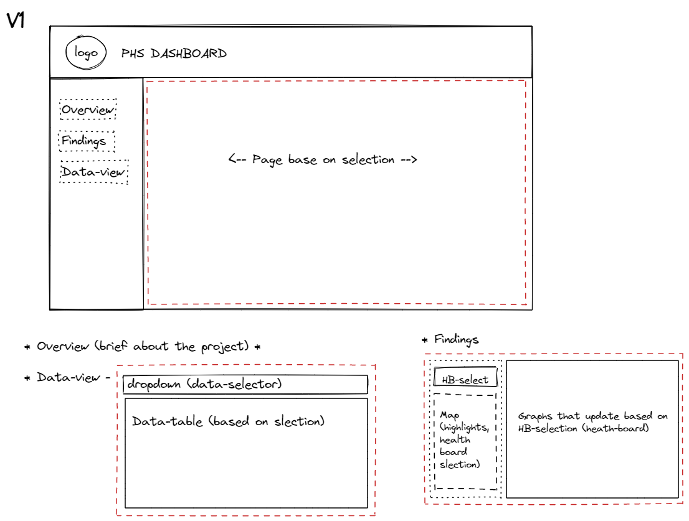
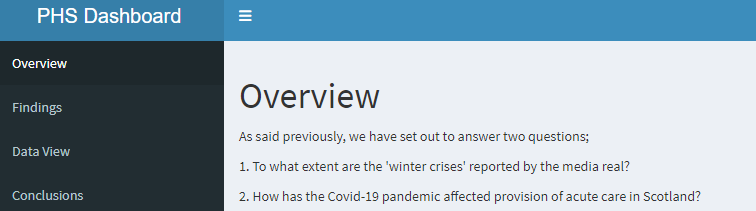
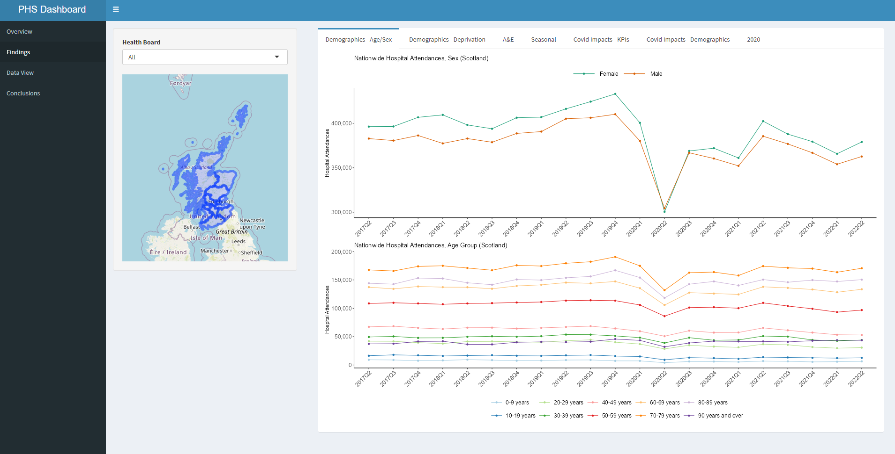
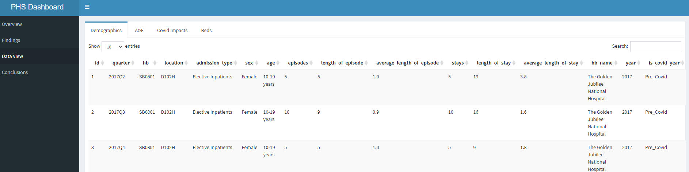

# Dashboard Group Project

## Introduction

As part of the Data analysis course, we had to create a dashboard using Rstudio and Shiny. To answer what extent the `Winter Crises` reported in the media is real and to determine how Covid-19 has affected acute care in Scotland.
 
## Data Used
Datasets were taken from [Public Health of Scotland](https://www.opendata.nhs.scot/dataset/inpatient-and-daycase-activity)

## Group members
[Andrew Wyllie](https://github.com/awyllie87),
[Ben Hinton](https://github.com/HintonData) and
[Matthew Marr](https://github.com/mjmarr)

### Stages of the project

- Planning & dashboard wireframe
- Git branching & version control
- Choosing datasets
- Data exploration, cleaning & analysis
- Identifying graphs to use
- Creating the Dashboard
- Presentation and report

## Ethical and legal considerations of the data

There are no ethical considerations, because the data is aggregated in a specific way that anonymize individuals, to remove any possible way to identify specific individuals from the data.

The datasets are covered by the Open Government License, which means that anyone can use the dataset as long as they acknowledge the source.

## Tools used
- Zoom (daily stand-ups and occasional mob programming)
- Git/GitHub (collaboration & version control)
- Slack (Communications & collaboration)
- Google Docs
- R studio

## Dashboard Images

### wireframe design

### overview

### findings

### data_view

